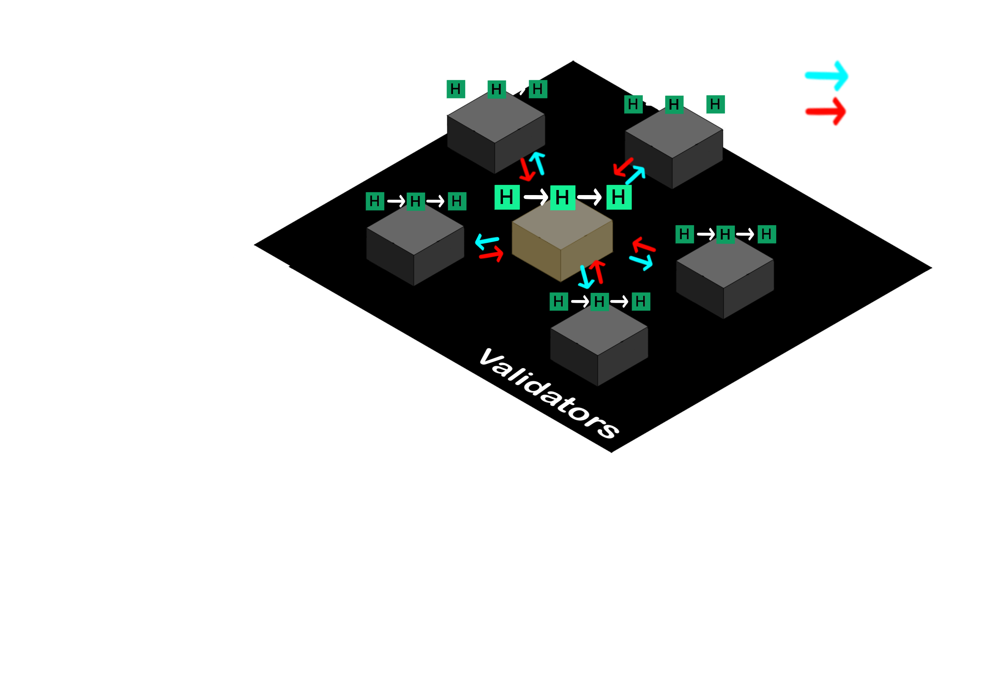
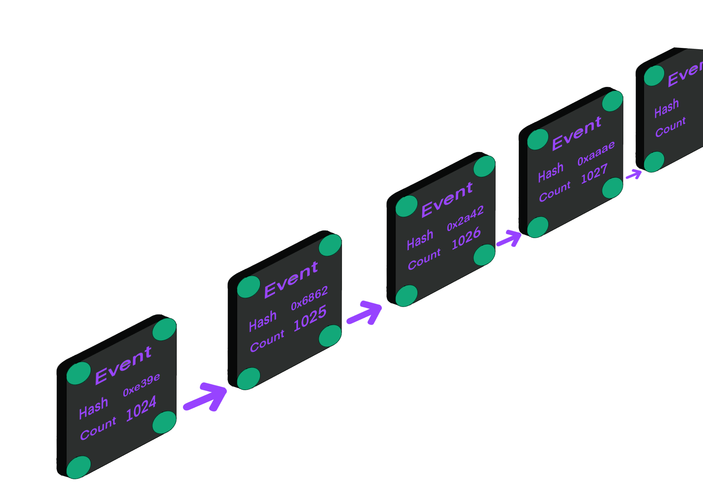
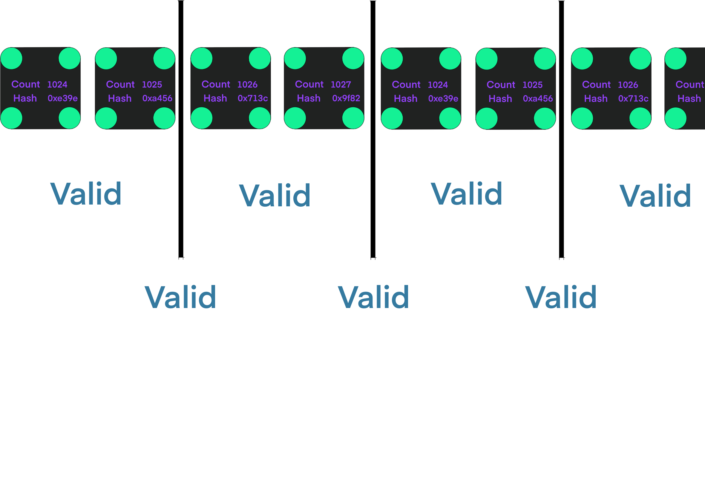
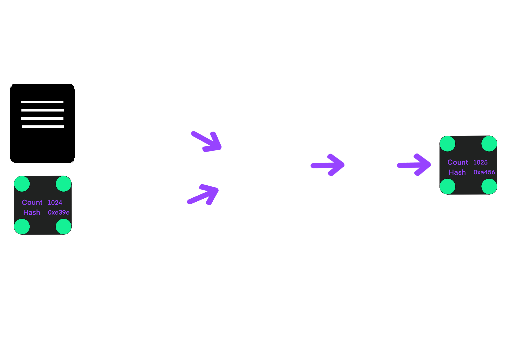
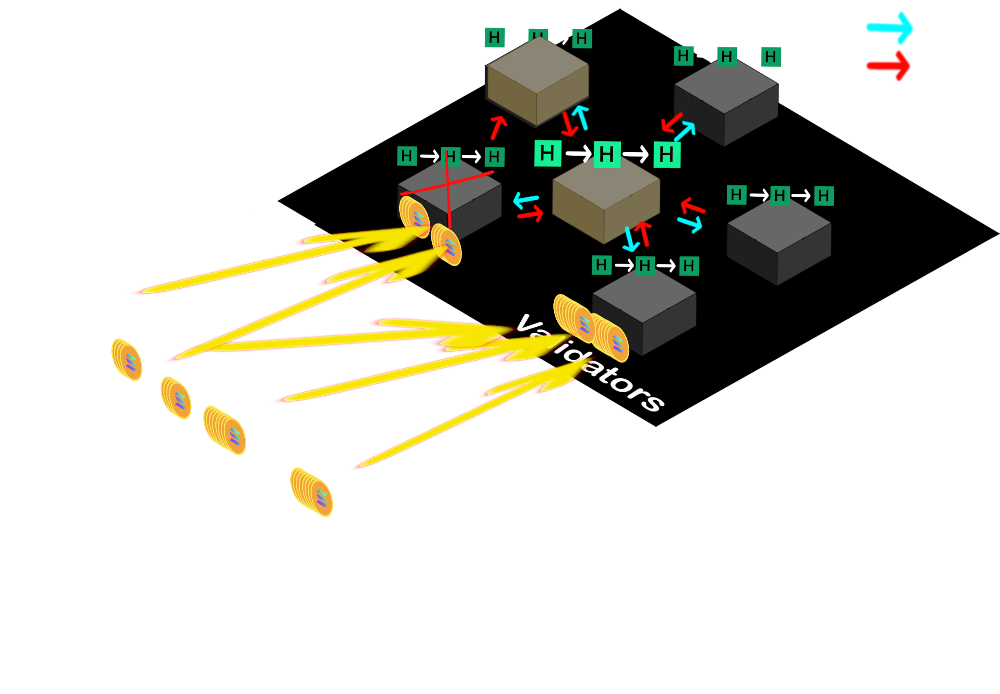

# Solana Whitepaper 要点まとめ
### 原典: *Solana: A new architecture for a high performance blockchain* v0.8.13（Anatoly Yakovenko）

- 目的：原文に忠実／誤解しやすい点は補足
- 対象：分散システム／暗号／ブロックチェーンの経験者
- 範囲：PoH, PoS, Fast PoRep, System Architecture, Network Limits, GPU-friendly VM

## 目次
1. 全体設計と役割（Leader/Verifier）
2. Proof of History（PoH）
3. Proof of Stake（PoS）アルゴリズム
4. 高速 Proof of Replication（Fast PoRep）
5. システムアーキテクチャと性能上限
6. まとめ／誤解ポイント

## 1. 全体設計（Network Design）

- 任意時点で **1つの Leader** が PoH 連鎖（履歴）を生成
- Leader は **取引を順序付けて実行 → 結果の状態ハッシュ** を発行
- **Verifier** は同じ順序で実行し、**状態署名** を発行＝**投票**
- リーダー選出・投票・罰則などは **PoS** が担当
- 分断時（Partition）は **一貫性優先**、ただし PoH により実時間に基づく扱いが可能

## 2. Proof of History（PoH）とは

**単一コアでしか前進できないハッシュ連鎖**で「出来事間の経過時間」を暗号学的に証明する“時計”。

- 連鎖： `hash_{i+1} = H(hash_i)` を延々と回す
- 途中途中で **（index, hash）** をチェックポイントとして公開
- 外部データ（イベントのハッシュ等）を **状態に混ぜる（append/combine）** ことで
  そのデータが **次のハッシュより前に存在**したことをタイムスタンプできる
- **検証は並列化**可（区間を分割し、多コア/GPUで検証）

## PoH：性質とスケーリング

- 事前計算不能／並列前進不能（逐次性） ⇒ **時計の信頼性**
- ただし **検証は並列化** できる（スライス検証）
- 複数 PoH 生成器の **水平スケーリング**：互いに状態をミックス可能（詳細は水平同期節）

## PoH：イベントタイムスタンプ化のイメージ

1. PoH 連鎖に外部データ（もしくはそのハッシュ）を **append**
2. その **次のハッシュ** が「このデータが挿入された後でしか生成されえない」証拠
3. その結果、**出来事の順序と概ねの経過時間**を検証者が推定できる

## PoH：攻撃考察（抜粋）
- **Reversal**（履歴逆転）: 途中から別の順序を作るには、正当連鎖の時間に追いつく必要がある
- **Speed**（高速化）: より速い計算資源が必要だが、ネットワーク全体としては追いつき困難
- **Long-range**: 古い鍵を入手しても、**当時と同程度以上の計算時間**が必要

## 3. Proof of Stake（PoS）アルゴリズムの位置づけ

<ul>
  <li>役割：<strong>PoH 連鎖の確認（投票）／次リーダー選出／スラッシング（罰則）</strong></li>
  <li>前提：<strong>メッセージは一定のタイムアウト内に到達</strong>する（部分同期）</li>
  <li>投票は基本 <strong>Yes のみ</strong>（状態署名の確認）</li>
  <li><strong>Super Majority（2/3）</strong> 重みで確定</li>
  <li><strong>Bonds（ステーク）</strong> はロックされ、違反時には <strong>Slashing</strong> され得る</li>
</ul>

## PoS：用語
- **Bond（担保）**: バリデータがロックするコイン
- **Slashing**: 二重投票や不正投票への罰則（担保没収）
- **Super Majority**: ステーク加重 2/3
- **Unbonding**: ロック解除（一定条件とタイムアウト）

## PoS：投票と最終性
- Leader は **一定間隔で状態署名** を発行
- Bonded な検証者は **自分の署名** を発行（Yes/No ではなく **Yes のみ**）
- **Super Majority** に達すればブランチが有効に
- **Finality**：PoH により「過去の時間」を観測できるため、**人間的に妥当なタイムアウト**で最終性扱い

## PoS：選挙とフォールバック
- **Secondary（予備）リーダー選出**：一次リーダーに障害／不正がある場合の切替
- **Fork 検知**：同一 PoH ID から異なる履歴が公開されたら不正
- **スラッシュ条件**：二重投票／PoH の不正ハッシュに対する投票 等

## 4. 高速 Proof of Replication（Fast PoRep）
**台帳を本当に保持していること**を、**検証容易・ストレージ効率良く**証明する仕組み。

- データを **暗号化 + 符号化（例：RS）** し、**Merkle ルート**を公開
- ネットワーク共通の **PoH に結びついたハッシュ**を乱数種にして、**バイトサンプリング**（ランダムオラクル的）
- **キー回転**：PoH の進行にあわせて暗号鍵を周期的に更新 ⇒ 再利用による抜け道を防ぐ
- **検証集約**：検証署名を **p2p で集めて一括提出**（スーパー・マジョリティ）

## Fast PoRep：攻撃と対策（抜粋）
- **Spam**：多数のレプリカIDで悪い証明をばら撒く  
  → 検証時は **暗号化データ＋全 Merkle ツリー**の提供を要求、GPU による並列検証
- **Hash Grinding**：PoH の公開ハッシュ前に悪意ある混入で有利な乱数を狙う  
  → 影響は限定的／署名一意性で利得は限定、検出・スラッシュ設計

## 5. システム構成（System Architecture）
**主なコンポーネント**
- **7.1.1 Leader（PoH generator）**：取引を順序化し、PoHと状態署名を配信
- **7.1.2 State**：簡素なハッシュテーブル想定（アカウント／ボンド等の固定長セル）
- **7.1.3 Verifier（State Replication）**：状態再実行と可用性確保、PoRep ノード選好
- **7.1.4 Validators**：コンセンサス節点（仮想）、Leader/Verifier と同居可

## Network Limits（帯域起因の理論上限）
- **最小トランザクションサイズ**のモデル化（署名等含め **約176 bytes**）
- **PoH パケット**は `current hash / counter / messages hash / state hash / signatures` 等で **~132 bytes**
- **1 Gbps** ネットワークでの理論最大：  
  `1e9 bit/s ÷ (176 bytes × 8)` ≒ **~710k TPS**（Ethernet フレーミングで 1–4% ロスを見込む）

## GPU-friendly スマートコントラクト実行
- **セクション 7.5**：GPU 多コア前提の **検証並列性**を活かす実行エンジン方針
- 目的：**検証のスループット最大化**（PoH/PoRep/検証を GPU で回す思想）

## まとめ（この白書が主張すること）
1. **PoH（時計）**で「順序と経過時間」を前提化 ⇒ **合意コストを削減**
2. **PoS** は確認・選挙・罰則に特化し、**分断時の取り扱い**も PoH で簡素化
3. **Fast PoRep** で改ざん困難な **“時間 × 空間”**の担保
4. 帯域・パケットモデルに基づく **上限見積もり（~710k TPS@1Gbps）**
5. GPU 前提の **検証並列化**に最適化

## 誤解しやすいポイント
- 本白書は **Turbine / Gulf Stream / Sealevel / Cloudbreak** といった**後年の命名**を前提にしていない  
  → 本文は **PoH / PoS / Fast PoRep / Network Limits / GPU 実行** で構成
- **最小 TX サイズ**や **710k TPS** は **ネットワーク帯域モデル**による理論上限であり、実運用の総合性能を保証するものではない
- PoH は **“検証は並列化可だが生成は逐次”** がキモ

## 参考（原文セクション）
- §3 Network Design（Leader/Verifier の流れ）
- §4 Proof of History（タイムスタンプ・検証並列・攻撃）
- §5 Proof of Stake（Bond/Vote/Slashing、選挙、Finality）
- §6 Fast Proof of Replication（暗号化・バイトサンプリング・キー回転・検証集約・攻撃）
- §7 System Architecture & Network Limits（パケット仕様、1Gbps→~710k TPS）、§7.5 GPU-friendly engine
